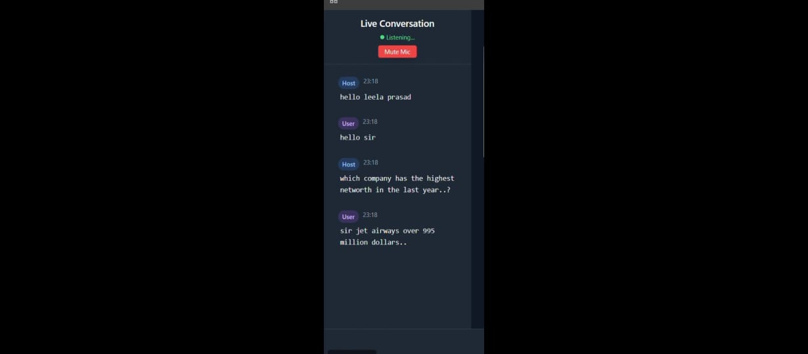

# LuminaSync - AI-Powered Meeting Intelligence


## 🚀 Elevator Pitch
LuminaSync transforms passive meeting documentation into an interactive experience by providing real-time, AI-powered suggestions and insights during meetings.

## ✨ Features

### 🎙️ Real-time Meeting Assistant
- Listens to conversations and provides contextual suggestions
- Retrieves relevant information from past meetings
- Offers intelligent action items and follow-ups

### 🔍 Smart Document Search
- Vector-based semantic search across all meeting documents
- Multimodal understanding of text and images
- Instant retrieval of related meeting notes and decisions

### 📊 Meeting Analytics
- Automatic meeting summarization
- Action item tracking
- Decision logging and follow-up

## 🖼️ Application Walkthrough

**Secure Login** - Our clean authentication interface ensures secure access to your meeting workspace. 

**Dashboard Overview** - Get a bird's eye view of your upcoming and past meetings with quick access to recent activities. 

**Create Custom Meetings** - Set up new meetings with customizable options for different meeting types and privacy settings. 

**Meeting Type Selection** - Choose from various meeting templates or create custom meeting flows tailored to your needs. 

**Host Interface** - Manage your meeting with our intuitive host controls, featuring real-time participant management and content sharing. 

**Intelligent Conversations** - Experience real-time AI-powered suggestions that understand the context of your discussions. 

**Smart Suggestions** - Get relevant information and action items surfaced automatically during your meetings. 

**Document Management** - Easily upload and access meeting-related documents with our streamlined interface. 

## 🛠️ Tech Stack

### Frontend
- React.js with TypeScript
- Tailwind CSS
- Framer Motion for animations
- Vite for build tooling

### Backend
- Python
- FastAPI
- WebSockets for real-time communication

### AI/ML
- Colpali for multimodal understanding
- RAG (Retrieval-Augmented Generation)
- Custom fine-tuned language models

### Database
- **TiDB** for scalable, distributed storage
  - Vector similarity search
  - Real-time data processing
  - Enterprise-grade reliability

## 🚀 Getting Started

### Prerequisites
- Node.js 16+
- Python 3.9+
- TiDB Cloud account
- OpenAI API key

### Installation
```bash
# Clone the repository
git clone [https://github.com/yourusername/luminasync.git](https://github.com/yourusername/luminasync.git)
cd luminasync

# Install frontend dependencies
cd frontend
npm install

# Install backend dependencies
cd ../backend
pip install -r requirements.txt
